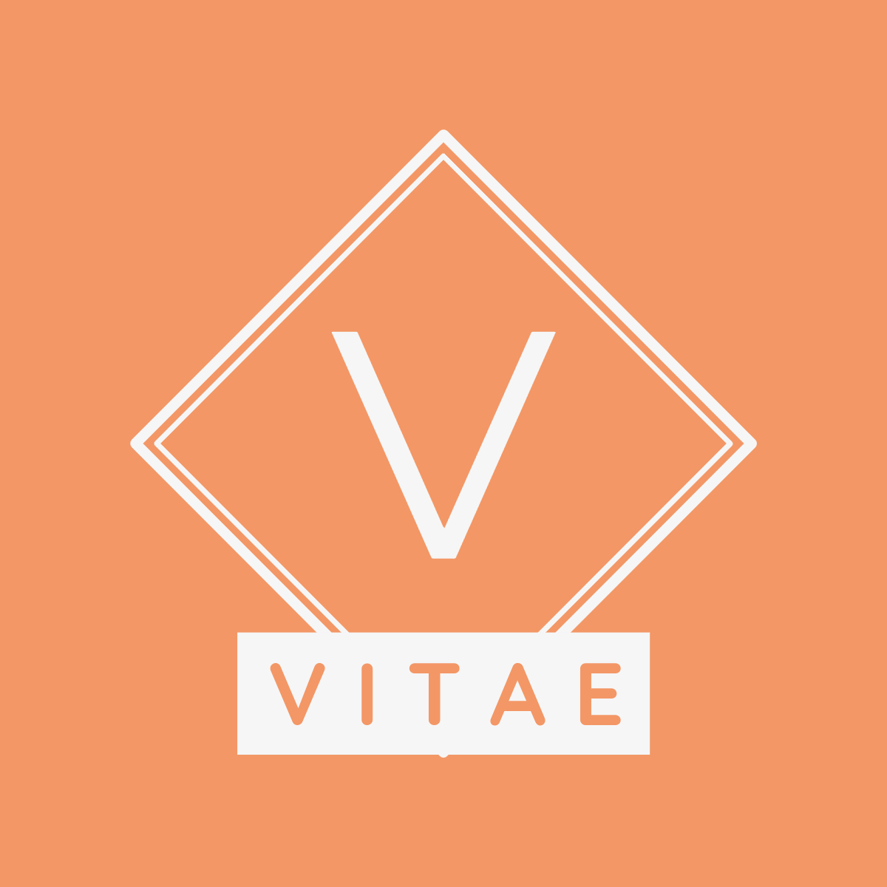

<div id="top"></div>

<!-- PROJECT SHIELDS -->

[![Contributors][contributors-shield]][contributors-url]
[![Forks][forks-shield]][forks-url]
[![Stargazers][stars-shield]][stars-url]
[![Issues][issues-shield]][issues-url]
[![MIT License][license-shield]][license-url]
[![LinkedIn][linkedin-shield]][linkedin-url]

<!-- PROJECT LOGO -->
<br />
<div align="center">
  <a href="https://github.com/BrunoViveiros/vitae">
    
  </a>

<h3 align="center">Vitae</h3>

  <p align="center">
    Simple, curriculum Vitae sample project.
    <br />
    <br />
    <a href="https://BrunoViveiros.github.io/vitae">View Demo</a>
    ·
    <a href="https://github.com/BrunoViveiros/vitae/issues">Report Bug</a>
    ·
    <a href="https://github.com/BrunoViveiros/vitae/issues">Request Feature</a>
  </p>
</div>

<!-- TABLE OF CONTENTS -->
<details>
  <summary>Table of Contents</summary>
  <ol>
    <li>
      <a href="#about-the-project">About The Project</a>
      <ul>
        <li><a href="#built-with">Built With</a></li>
      </ul>
    </li>
    <li>
      <a href="#getting-started">Getting Started</a>
      <ul>
        <li><a href="#prerequisites">Prerequisites</a></li>
        <li><a href="#installation">Installation</a></li>
      </ul>
    </li>
    <li><a href="#roadmap">Roadmap</a></li>
    <li><a href="#contributing">Contributing</a></li>
    <li><a href="#license">License</a></li>
    <li><a href="#contact">Contact</a></li>
  </ol>
</details>

<!-- ABOUT THE PROJECT -->

## About The Project

[![Vitae Screen Shot][product-screenshot]](https://BrunoViveiros.github.io/vitae)

<p align="right">(<a href="#top">back to top</a>)</p>

### Built With

- [React.js](https://reactjs.org/)
- [Sass](https://sass-lang.com/)

<p align="right">(<a href="#top">back to top</a>)</p>

<!-- GETTING STARTED -->

## Getting Started

To get a local copy up and running follow these simple example steps.

### Prerequisites

- node
  ```sh
  node -v
  ```
- yarn
  ```sh
  npm install -g yarn
  ```

### Installation

1. Clone the repo
   ```sh
   git clone https://github.com/BrunoViveiros/vitae.git
   ```
2. Go to the vitae directory
   ```sh
   cd vitae
   ```
3. Install Yarn packages
   ```sh
    yarn install
   ```

<p align="right">(<a href="#top">back to top</a>)</p>

<!-- ROADMAP -->

## Roadmap

- [x] Develop a fully static (no loops or any other kind of dynamically generated content) CV page following this style: https://stock.adobe.com/442990859.
- [x] For styles you should use SCSS
- [x] Use the BEM CSS methodology
- [ ] Everything that is based on a list from the previous implementation should become an array that is gonna be interated
- [ ] For each list, add a input field and a plus button below it that allows the user to add a new item to that list.
- [ ] For each list item, add a x button after it that allows the user to remove that item.

See the [open issues](https://github.com/BrunoViveiros/vitae/issues) for a full list of proposed features (and known issues).

<p align="right">(<a href="#top">back to top</a>)</p>

<!-- CONTRIBUTING -->

## Contributing

Contributions are what make the open source community such an amazing place to learn, inspire, and create. Any contributions you make are **greatly appreciated**.

If you have a suggestion that would make this better, please fork the repo and create a pull request. You can also simply open an issue with the tag "enhancement".
Don't forget to give the project a star! Thanks again!

1. Fork the Project
2. Create your Feature Branch (`git checkout -b feature/AmazingFeature`)
3. Commit your Changes (`git commit -m 'Add some AmazingFeature'`)
4. Push to the Branch (`git push origin feature/AmazingFeature`)
5. Open a Pull Request

<p align="right">(<a href="#top">back to top</a>)</p>

<!-- LICENSE -->

## License

Distributed under the MIT License. See `LICENSE.txt` for more information.

<p align="right">(<a href="#top">back to top</a>)</p>

<!-- CONTACT -->

## Contact

Bruno Viveiros - bruno.viveiros@codeminer42.com

Project Link: [https://github.com/BrunoViveiros/vitae](https://github.com/BrunoViveiros/vitae)

<p align="right">(<a href="#top">back to top</a>)</p>

<!-- MARKDOWN LINKS & IMAGES -->
<!-- https://www.markdownguide.org/basic-syntax/#reference-style-links -->

[contributors-shield]: https://img.shields.io/github/contributors/BrunoViveiros/vitae.svg?style=for-the-badge
[contributors-url]: https://github.com/BrunoViveiros/vitae/graphs/contributors
[forks-shield]: https://img.shields.io/github/forks/BrunoViveiros/vitae.svg?style=for-the-badge
[forks-url]: https://github.com/BrunoViveiros/vitae/network/members
[stars-shield]: https://img.shields.io/github/stars/BrunoViveiros/vitae.svg?style=for-the-badge
[stars-url]: https://github.com/BrunoViveiros/vitae/stargazers
[issues-shield]: https://img.shields.io/github/issues/BrunoViveiros/vitae.svg?style=for-the-badge
[issues-url]: https://github.com/BrunoViveiros/vitae/issues
[license-shield]: https://img.shields.io/github/license/BrunoViveiros/vitae.svg?style=for-the-badge
[license-url]: https://github.com/BrunoViveiros/vitae/blob/master/LICENSE.txt
[linkedin-shield]: https://img.shields.io/badge/-LinkedIn-black.svg?style=for-the-badge&logo=linkedin&colorB=555
[linkedin-url]: https://linkedin.com/in/brunoviveiros
[product-screenshot]: public/images/screenshot.png
